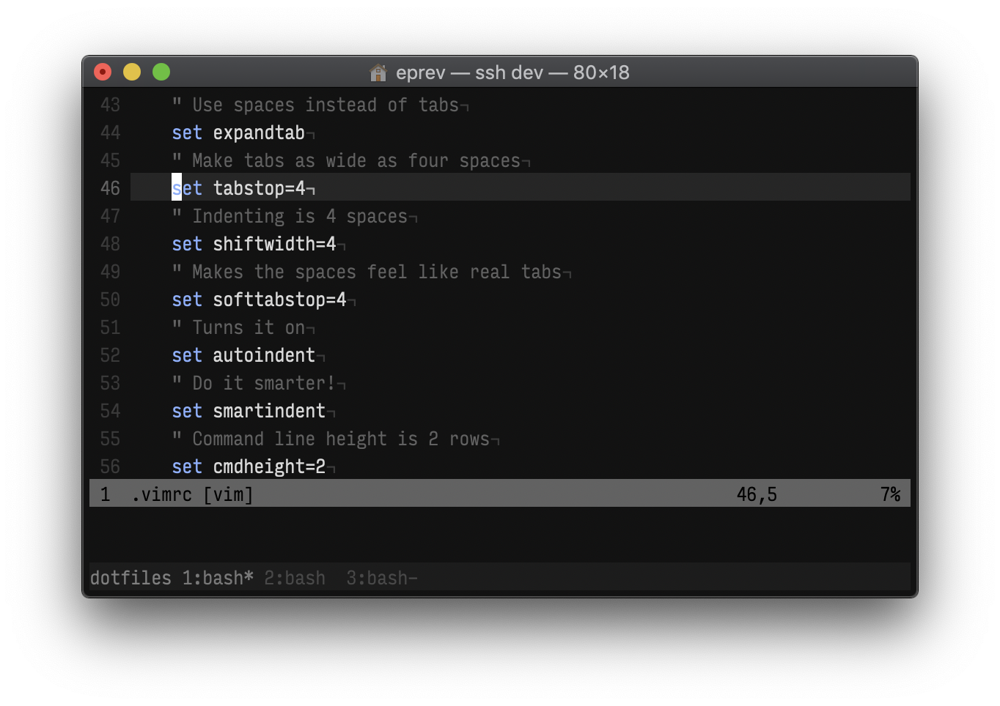

# ~/.\*



## Setup

1. Run:

   ```
   curl -L https://github.com/eprev/dotfiles/raw/master/bin/dot-install | bash
   ```

2. Don't forget to update user details in `~/.gitconfig`.

3. In addition, the following steps may be required:

   - You might want to try [locationchanger](https://github.com/eprev/locationchanger).

   - Like the font in the screenshot? It's [Input Font](http://input.fontbureau.com/) (InputMonoCondensed-Light, 13pt).

## Update

```
dot-update
```
